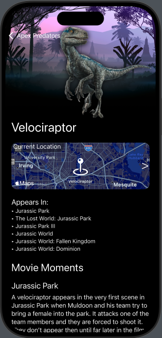

# Jurassic Park Apex Predators

Welcome to the **Jurassic Park Apex Predators** iOS app! Dive into the thrilling world of Jurassic Park and explore detailed profiles of the iconic dinosaurs featured in the franchise. This app is your ultimate companion to learn about and visualize these legendary creatures from the Jurassic Park universe, right on your iOS device.

## Features

### 🦖 Comprehensive Dinosaur List
- Browse a complete list of all the dinosaurs that appeared in the Jurassic Park movies.

### 🔍 Search and Sort
- Effortlessly search for and sort dinosaurs with powerful search and sorting features.

### 📄 Detailed Dinosaur Information
- Access detailed information on each dinosaur, including:
  - **Movie Appearance**: Learn which movies each dinosaur appeared in.
  - **Key Moments**: Relive iconic scenes featuring each dinosaur.

### 🗺️ Map View
- View fictional locations for each dinosaur on an interactive map (note that these locations do not represent actual fossil findings).

### 🦕 iMessage Sticker Pack
- Share your love for dinosaurs with a fun and engaging iMessage sticker pack included in the app!

## Screenshots

| Dinosaur List | Dinosaur Details | Map View |
|---------------|------------------|----------|
|  |  |  
## Installation

1. Clone the repository:
   ```bash
   git clone https://github.com/yourusername/Jurassic-Park-Apex-Predators.git
